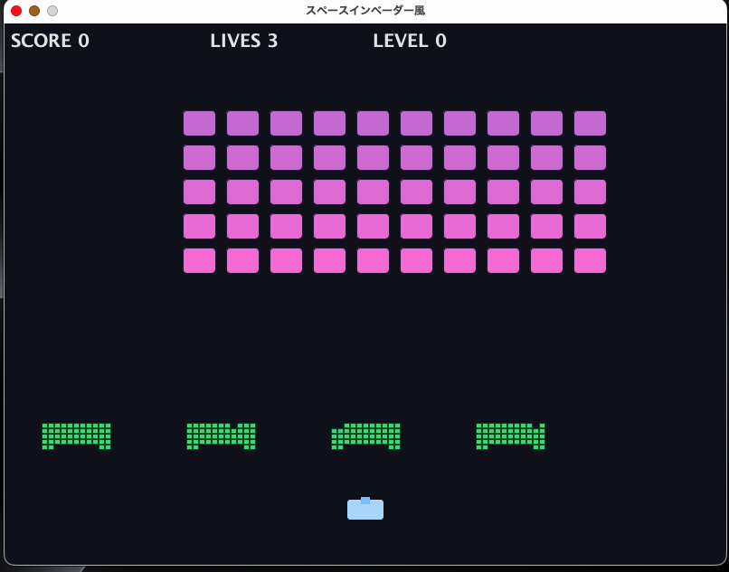

# インベーダーゲーム (Space Invaders) - Java版



Swing（追加ライブラリなし）で実装したスペースインベーダー風の2Dシューティングです。  
自機を操作して敵フォーメーションを全滅させると次レベルへ進みます（レベル0〜3の全4段階）。

## 動作環境（JDK25 / Swing / 追加ライブラリなし）

- JDK: **25**
- UI: **Swing**
- 外部ライブラリ: **使用しない**
- 実行環境: デスクトップ（ウィンドウ表示）

## ビルド方法（javac *.java）

```bash
cd /Users/takashioikawa/Dev/teaching-lab/java/invaders_game
javac *.java
```

## 起動方法（java Main）

```bash
cd /Users/takashioikawa/Dev/teaching-lab/java/invaders_game
java Main
```

## 操作方法（←→スペース・R・ESC）

- **← / →**: 自機移動
- **スペース**: 弾を発射（連射はクールダウンあり）
- **R**: ゲームオーバー／ゲームクリア時に最初から再開
- **ESC**: 終了

## ゲームルール

- **勝利条件**: そのレベルの敵を全滅するとステージクリア → 次レベルへ
- **敗北条件**:
  - 敵が自機ライン（侵攻ライン）に到達する
  - 自機が敵弾に当たり、残機が0になる
- **バリア**:
  - 4基配置
  - 弾が当たるとセル単位で欠けていく（段階的破壊）
- **表示**: スコア / 残機 / 現在レベル を画面上部に表示

## レベル仕様（レベル0〜3）

- レベルは **0, 1, 2, 3** の4段階
- レベルが上がるほど、敵の移動速度・下降量・敵弾の速度・敵弾の頻度が上がる
- **レベル3をクリア**すると「GAME CLEAR!」を表示（Rで最初から、ESCで終了）

## ファイル構成（7ファイルの役割一覧）

- `Main.java`
  - エントリーポイント（ウィンドウ生成と `GamePanel` 表示のみ）
- `GamePanel.java`
  - ゲーム状態管理、メインループ（`javax.swing.Timer`）、入力、更新、描画、衝突、勝敗判定、レベル進行
- `Player.java`
  - 自機の移動、位置リセット、描画
- `Enemy.java`
  - 敵1体の状態、得点、描画
- `EnemySwarm.java`
  - 敵フォーメーションの移動・下降、侵攻判定、射撃者選択
- `Bullet.java`
  - 自機弾／敵弾の移動、画面外判定、描画
- `Barrier.java`
  - バリア（セル集合）と段階的破壊、描画

## Git管理について

- 生成物（`*.class`）はコミット対象にしない運用を推奨します（`.gitignore` に追加するなど）。
- 本リポジトリではソースコードとドキュメント（`README.md` / `SPEC.md` / `images/`）を管理対象とします。
- コミットメッセージ・ドキュメント本文・ソース内コメントは **日本語** で記述します。

