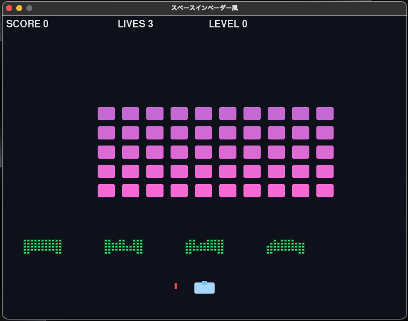

# インベーダーゲーム (Space Invaders)


スペースインベーダー風のレトロアーケードゲームです。Pythonとpygameで実装しています。

## 動作環境
- **OS**: macOS / Windows / Linux
- **Python**: 3.10以上（本プロジェクトは `venv` 利用を前提）
- **ライブラリ**: `pygame` のみ（`requirements.txt` 参照）

## セットアップ手順（venv作成・SDL2インストール含む）
このプロジェクトは pygame のみを利用しますが、環境によっては SDL2 系の依存が必要です。

### 1) Python仮想環境（venv）を作成
プロジェクト直下（`python/invaders_game/`）で実行します。

```bash
python -m venv venv
```

### 2) 依存パッケージをインストール

```bash
source venv/bin/activate
pip install -r requirements.txt
```

### 3) SDL2 について
- **macOS / Windows**: 通常は `pip install pygame` で同梱バイナリが入るため、追加の SDL2 インストールが不要なことが多いです。
- **Linux**: ディストリビューションによっては SDL2 等の開発ライブラリが必要になることがあります。例（Ubuntu系）:

```bash
sudo apt update
sudo apt install -y libsdl2-2.0-0 libsdl2-mixer-2.0-0 libsdl2-image-2.0-0 libsdl2-ttf-2.0-0
```

（上記は一例です。環境によりパッケージ名が異なる場合があります）

## 起動方法

```bash
source venv/bin/activate
python main.py
```

## 操作方法（←→スペース・R・ESC）
- **← / →**: 自機の左右移動
- **Space**: 弾の発射（クールダウンあり）
- **R**: ゲームオーバー／ゲームクリア画面から最初から再開
- **ESC**: 終了

## ゲームルール
- 自機を操作して敵を撃破します。
- 敵は左右移動し、端に到達すると反転して**一定量下降**します。
- 敵弾または敵の侵攻により敗北します。

### 勝利条件
- そのレベルの敵をすべて撃破するとステージクリアし、**次のレベルへ進行**します。
- **レベル3**の敵を全滅させると **GAME CLEAR** となりゲーム終了状態になります（Rで再開可能）。

### 敗北条件
- **敵が自機ライン（侵攻ライン）に到達**した場合
- **自機が被弾**し、残機が 0 になった場合

## レベル仕様（レベル0〜3）
- レベルは **0〜3** の全4段階です（`Game.MAX_LEVEL = 3`）。
- レベルが上がるほど以下が強化されます。
  - **敵の横移動速度**（`EnemySwarm.move_speed`）
  - **敵の下降量**（`EnemySwarm.descent_step`）
  - **敵弾の速度**（`vy = 4.0 + level * 1.2`）
  - **敵の射撃間隔**（短くなる。下限あり）

## ファイル構成
- `main.py`: エントリーポイント（`Game().run()` のみ）
- `game.py`: ゲームループ、状態管理、衝突判定、描画、HUD、レベル進行
- `player.py`: 自機（入力、移動、描画）
- `enemy.py`: 敵1体と敵群（フォーメーション）移動・侵攻判定・発射者選択
- `bullet.py`: プレイヤー弾／敵弾の移動・描画・画面外削除
- `barrier.py`: バリア（段階的破壊）
- `requirements.txt`: 依存ライブラリ（pygame）

## Git管理について
- **`venv/` は Git 管理対象外**です（`.gitignore` により除外）。
- **`requirements.txt` は Git 管理対象**です（再現可能な環境構築のため）。
- 本ゲームのソースは `python/invaders_game/` 配下にまとまっています。

