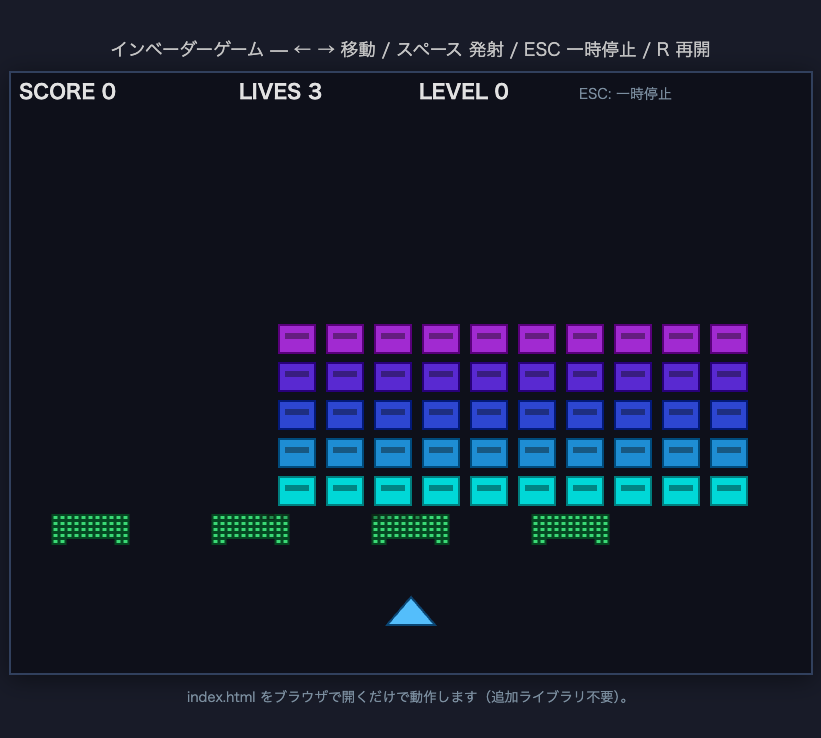

# インベーダーゲーム (Space Invaders) - Web版

HTML5 Canvas と JavaScript のみで実装した、スペースインベーダー風のシューティングゲームです。

## 動作環境（モダンブラウザのみ・追加インストール不要）

- **対応**: モダンなデスクトップブラウザ（Chrome、Firefox、Safari、Edge など）
- **技術**: HTML5、Canvas 2D、素の JavaScript（ビルドや npm 不要）
- **制限**: スマートフォン向けのタッチ操作は未対応（キーボード前提）

## 起動方法（index.htmlをブラウザで開く）

1. リポジトリ内の `web/invaders_game/index.html` をエクスプローラ／Finder からダブルクリックするか、ブラウザにドラッグ＆ドロップして開きます。
2. ローカルファイル（`file://`）のままで動作します。Web サーバの起動は不要です。

## 操作方法（←→スペース・R・ESC）

| キー | 動作 |
|------|------|
| **←** **→** | 自機を左右に移動 |
| **スペース** | 弾を発射（連射にはクールダウンあり） |
| **ESC** | プレイ中は一時停止、停止中は再開 |
| **R** | 一時停止中・ゲームオーバー・ゲームクリア画面から、スコア・レベル・残機をリセットして最初から再開 |

## ゲームルール

- 自機の弾で敵を全滅させるとステージクリアです。残機とスコアは維持されたまま次レベルへ進みます。
- **敗北**: 敵のいずれかが自機ライン（侵攻ライン）まで降りてくる、または自機が敵弾に当たると残機が 1 減ります。残機が 0 になるとゲームオーバーです。
- 画面下付近に **4 基のバリア** があり、自機弾・敵弾が当たるとセル単位で耐久が減り、段階的に崩れていきます。
- 敵は全体で左右に移動し、画面端に達すると方向を反転しつつ一段下降します。レベルが上がるほど移動・下降が速くなります。
- 敵もランダムに弾を撃ってきます。

## レベル仕様（レベル0〜3）

| レベル | 内容 |
|--------|------|
| **0〜3** | 全 4 段階。敵の横移動速度・端での下降量、敵弾の出る間隔・速さがレベルに応じて強くなります。 |
| **クリア条件** | **レベル 3** の敵を全滅させると **ゲームクリア** 表示となり、そこでストーリー上のクリアです（R で最初から再プレイ可能）。 |

画面上部の HUD に **スコア（SCORE）**、**残機（LIVES）**、**現在レベル（LEVEL）** が表示されます。

## ファイル構成

```
web/invaders_game/
├── index.html      # Canvas とスクリプト読み込み
├── README.md       # 本ファイル
├── SPEC.md         # プログラム仕様書
├── .gitignore
└── js/
    ├── main.js     # エントリ（Game 生成と start のみ）
    ├── game.js     # ゲームループ・状態・衝突・レベル・HUD
    ├── player.js   # 自機クラス
    ├── enemy.js    # 敵1体・敵群クラス
    ├── bullet.js   # 弾クラス
    └── barrier.js  # バリアクラス
```

## Git管理について

- 本ディレクトリは `teaching-lab` リポジトリの `web/invaders_game/` としてバージョン管理できます。
- `.gitignore` で macOS の `.DS_Store` を除外しています。
- 画像やスクショを追加する場合は `images/` などを作成し、README のプレースホルダーを差し替えるとよいです。
